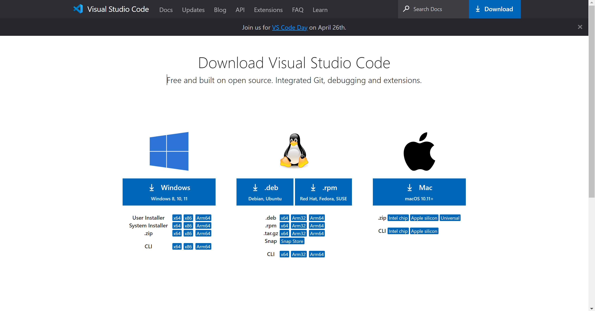
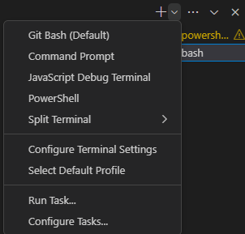
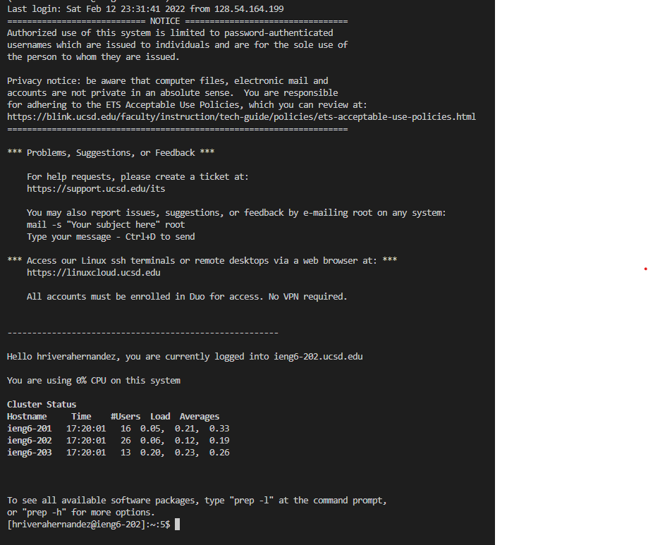
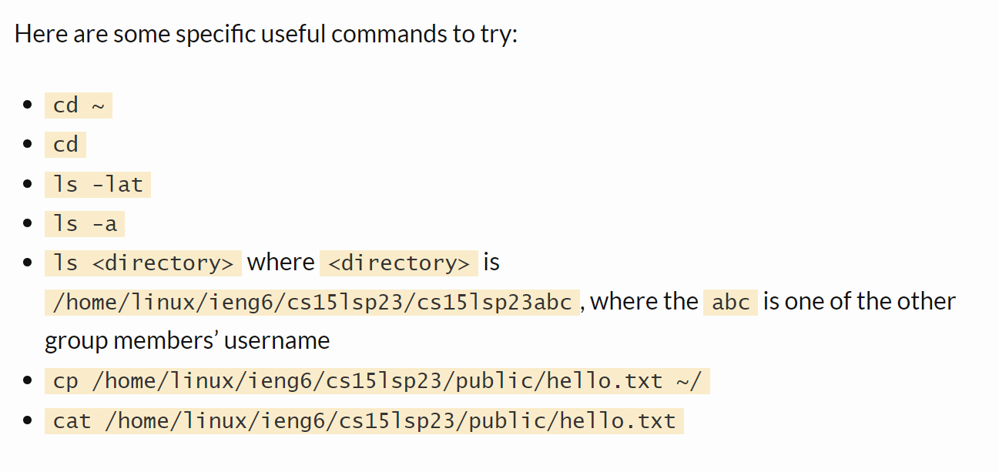
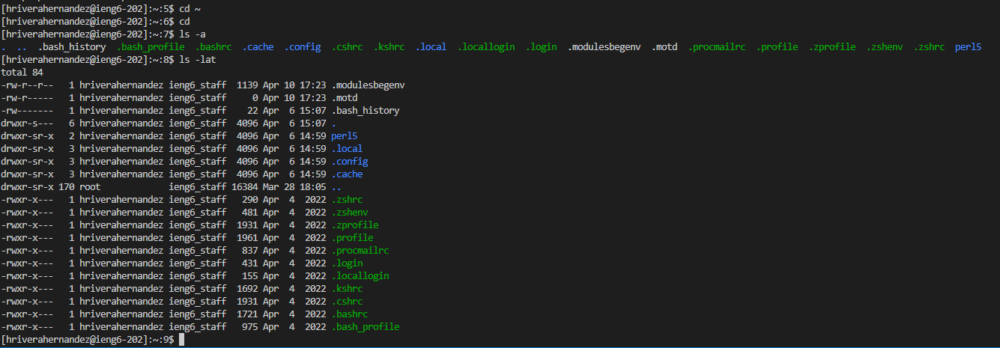

# Lab Report 1
## Remote Access Instructions

1) Installing VS Code  
I did not have to do this step exactly as I already had VS Code installed on my device, However, the steps that I took to download VS Code were:
- Download the appropiate version of VS Code here: [Link](https://code.visualstudio.com/download)
- 
- Follow steps provided by VS Code to complete download
  
  
2) Remotely Connecting  
During the Lab, my CS 15l account was not working and had to use my regular ucsd account
- Open bash terminal in VS Code
- 
- Type "hriverahernandez@ieng6.ucsd.edu" in the terminal (*This is wahat I did in the Lab*)
- Enter account Password when prompted
- Should See this when complete: 
- 
  
  
3) Trying Commands:
- Here is the list of provided commands:
- 
- Here are the commands I used and their results:
- 
