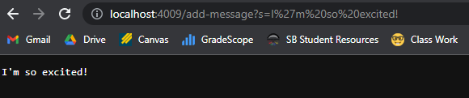
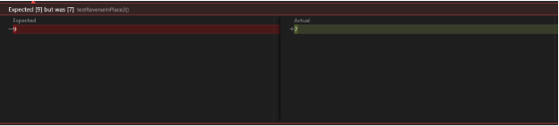
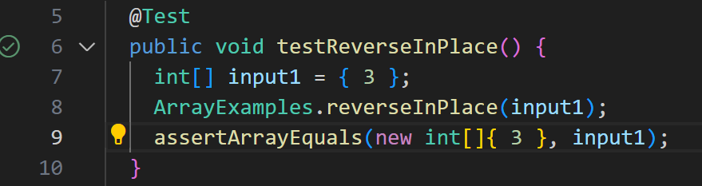

# Lab Report 2
## Part 1: String Server

1) StringServer.java
Here is the complete code used for StringServer.java (Code was modified from NumberServer.java):
```
import java.io.IOException;
import java.net.URI;

class Handler implements URLHandler {

    String str = "";

    public String handleRequest(URI url) {
        if (url.getPath().equals("/")) {
            return String.format(str);
        } else {
            System.out.println("Path: " + url.getPath());
            if (url.getPath().contains("/add-message")) {
                String[] parameters = url.getQuery().split("=");
                str += parameters[1] + "\n";
                return String.format(str);
            }
            return "404 Not Found!";
        }
    }
}

class StringServer {
    public static void main(String[] args) throws IOException {
        if(args.length == 0){
            System.out.println("Missing port number! Try any number between 1024 to 49151");
            return;
        }

        int port = Integer.parseInt(args[0]);

        Server.start(port, new Handler());
    }
}
```

2) Code In Action  

- The method called in this screenshot is `add-message`
- The relevant arguments to the method are `url`, `parameters`, and `str`. Their current values are: 
    - `url` is `http://localhost:4009/add-message?s=I'm so excited!`
    - `parameters` is `["s", "I'm so excited!]"`
    - `str` is ` `
- `str` changes since "I'm so excited!" and `\n` is concatinated to `str` 
    - `str` is now `I'm so excited!` 
  
    

- The method called in this screenshot is `add-message`
- The relevant arguments to the method are `url`, `parameters`, and `str`. Their current values are: 
    - `url` is `http://localhost:4009/add-message?s=TOTK releases May 12!`
    - `parameters` is `["s", "TOTK releases May 12!]"`
    - `str` is now `I'm so excited!`
- `str` changes since "TOTK releases May 12!" and `\n` is concatinated to `str`
    - `str` is now 
```
I'm so excited!
TOTK releases May 12!
```

  
## Part 2: Bugs
- The bug that I'll do will be with the `reverseInPlace` method
- The failure inducing input is:
```
 @Test 
	public void testReverseInPlace2() {
    int[] input1 = {9, 8, 7 };
    ArrayExamples.reverseInPlace(input1);
    assertArrayEquals(new int[]{7, 8, 9}, input1);
	}
```
- The sypmtom is:  

  
- The non-failure inducing input is:
```
@Test 
	public void testReverseInPlace() {
    int[] input1 = { 3 };
    ArrayExamples.reverseInPlace(input1);
    assertArrayEquals(new int[]{ 3 }, input1);
	}
```
- The sypmtom is:  

  
- The bug before the code change:
```
static void reverseInPlace(int[] arr) {
    for(int i = 0; i < arr.length; i += 1) {
      arr[i] = arr[arr.length - i - 1];
    }
  }
```
- The bug after the code change:
```
static void reverseInPlace(int[] arr) {
    for(int i = 0; i < arr.length / 2; i += 1) {
      int temp = arr[i];
      arr[i] = arr[arr.length - i - 1];
      arr[arr.length - i - 1] = temp;
    }
  }
```
  
## Part 3: Learning
Something I've learned in Lab 3 was to create multiple tests for a program, and even ask peers for test ideas. This is important as some tests will pass, but other tests can show obscure errors in the code, and more tests will create a more complete picture of how the program reacts to inputs.
