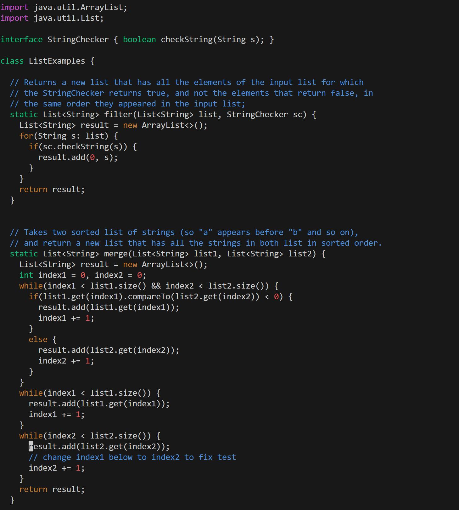
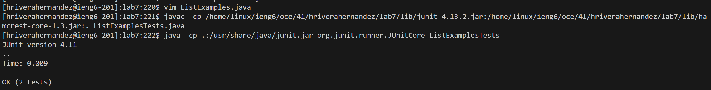
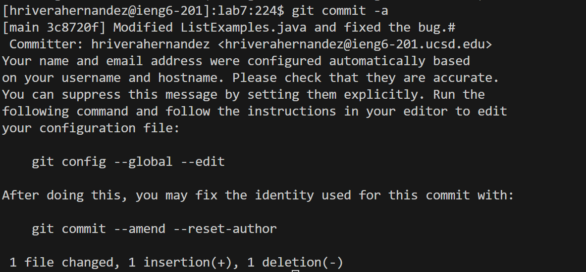

# Lab Report 4
## Learning with VIM  
- Logging into `ieng6`

    - Typed `hriverahernandez@ieng6.ucsd.edu` and pressed `<ennter>`
    - I used my `hriverahernandez` account because I couldn't sign into my `cse15l` account
- Cloning Lab7 Repository

    - Typed `git clone https://github.com/hriverahernandez/lab7` and pressed `<enter>`
    - Typed `cd lab7` to enter the Lab7 directory
- Failed Tests

    - Typed `javac -cp /home/linux/ieng6/oce/41/hriverahernandez/lab7/lib/junit-4.13.2.jar:/home/linux/ieng6/oce/41/hriverahernandez/lab7/lib/hamcrest-core-1.3.jar:. ListExamplesTests.java` and 
      pressed `<enter>` to compile the tests in `ListExamplesTests.java`  
    - Typed `java -cp .:/usr/share/java/junit.jar org.junit.runner.JUnitCore ListExamplesTests` and pressed `<enter>` to run the tests in `ListExamplesTests.java`
- Fixing Bugs

    - Typed `vim ListExamples.java` and pressed `<enter>` to edit the `ListExamples.java` file
    - In normal mode, typed `/index1` and pressed `<enter>` to search for all instances of "index1"
    - Pressed `n` 9 times to reach the desired instance of "index"
    - Pressed `<right arrow>` 5 times to reach "1"
    - Pressed `r` to enter replace mode and pressed `2` to replace "1" with "2"
    - Pressed `<esc>` to enter normal mode and typed `:wq` to save and quit
- Passing Tests

    - Pressed `<up arrow>` 3 times and `<enter>` to compile `ListExamplesTests.java`
        - `javac -cp /home/linux/ieng6/oce/41/hriverahernandez/lab7/lib/junit-4.13.2.jar:/home/linux/ieng6/oce/41/hriverahernandez/lab7/lib/hamcrest-core-1.3.jar:. ListExamplesTests.java` was 3 up in the search history
    - Pressed `<up arrow>` 3 times and `<enter>` to run `ListExamplesTests.java`
        - `java -cp .:/usr/share/java/junit.jar org.junit.runner.JUnitCore ListExamplesTests` was 3 up in the search history
- Commiting Changes

    - Typed `git commit -a` and pressed `<enter>` to write a commit message
    - Pressed `<down arrow>` 10 times to reach a new line to add my message
    - Pressed `i` to enter insert mode and typed ` Modified LastExamples.java and fixed the bug.`
    - Pressed `<esc>` to enter normal mode and typed `:wq` to save and quit
