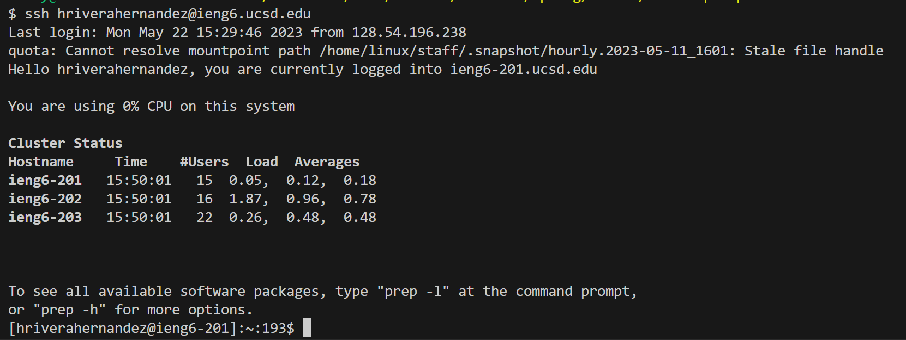
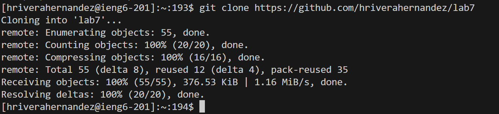
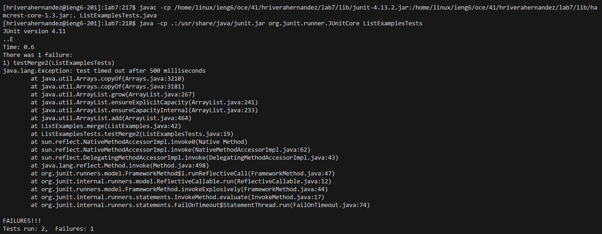

# Lab Report 4
## Learning with VIM  
- Logging into `ieng6`

    - Typed `hriverahernandez@ieng6.ucsd.edu` and pressed `<ennter>`
    - I used my `hriverahernandez` account because I couldn't sign into my `cse15l` account
- Cloning Lab7 Repository

    - Typed `git clone https://github.com/hriverahernandez/lab7` and pressed `<enter>`
- Failed Tests

    
