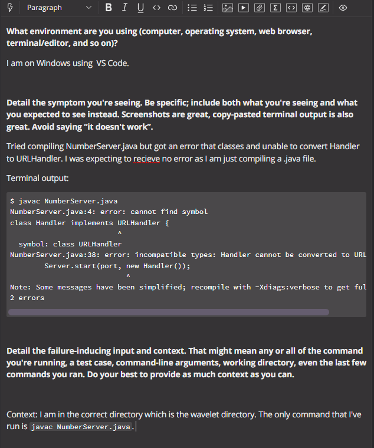

# Lab Report 5
## Debugging Scenario

- Project used for Scenario:
    - I used the `wavelet` repository from Week 2 Lab 
    - The bug was not compiling all necessary files for the code to run properly
  
- Post of Student:  

  
- Response from TA:
    - "Good Evening, I believe that there are tweo files in `wavelet` regarding running servers. Try compiling both `.java` files since one of those files relies on another."
  
- Updated Terminal Output with help from TA:  

  
- Needed Setup:
    - I used files from the `wavelet` repository and was in the `wavelet` directory
    - The code in the files was unchanged, rather the issue was in running the commands in the terminal and having incomplete commands.
    - The full command line to trigger the bug was `javac NumberServer.java` which excluded `Server.java`
    - To fix the issue, we needed to include `Server.java` into our compiling command so that `NumberServer.java` could take commands from the URl and return the corresponding output.

  
## Reflection
- For me, the biggest help that I learned from my Lab experience in the second quarter was just how much I could do from the terminal. The biggest helper was VIM since I feel like editing files in the terminal could be very useful in the real world and maybe even cut the time needed on a project. The next biggest thing I learned was commiting things from both the terminal and from Github Desktop. I have never used either before this class and having experience on how to do both is important since I know Github and collaboration are used heavily in computer fields.
